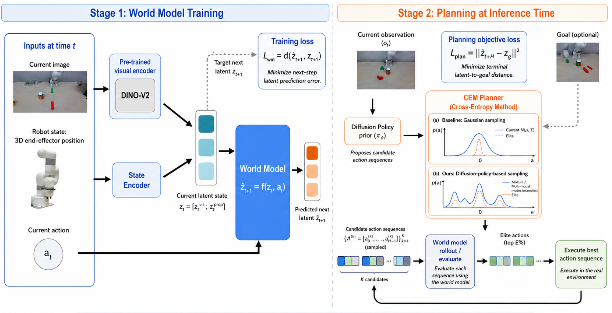
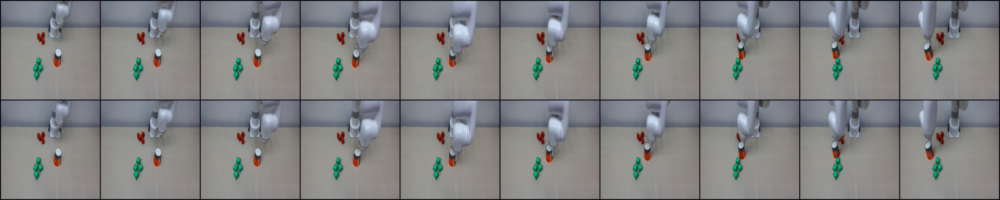

# Goal-Conditioned Planning with Visual World Models
Yang Liu, Minseong Kweon, Ryan Vatini, Tian Xie

## Project Overview

We study goal-conditioned object pushing with a Lite6 robot arm using DINO-WM
for visual world model planning. We evaluate whether a diffusion-policy prior
improves planning efficiency over standard CEM-based planning.



- Encode current and goal images using frozen DINOv2 features
- Predict future latent states using DINO-WM under sampled action sequences
- Optimize action sequences with Cross-Entropy Method (CEM) using predicted goal distance as the objective
- Compare standard Gaussian CEM vs. diffusion-policy guided CEM
- Execute the best first action and replan at the next step

## Training

This workspace contains two separate training codebases:

- `diffusion_policy`: train the diffusion policy
- `dino_wm`: train the DINO world model

## 1. Train `diffusion_policy`

### Install

```bash
cd diffusion_policy
conda env create -f conda_environment_demo_xyz.yaml
conda activate robodiff_demo
pip install -e .
```

### Train

```bash
cd diffusion_policy
python train.py --config-name=train_diffusion_unet_demo_xyz_image_workspace \
  task.dataset_path=your_data_path
```

## 2. Train `dino_wm`

### Install

```bash
cd dino_wm
conda env create -f environment.yaml
conda activate dino_wm
```

### Train

```bash
cd dino_wm
python train.py --config-name train_lite6_xyz \
  env.dataset.data_path=your_data_path \
  ckpt_base_path=your_output_path
```
## Results

<p align="center">
  
</p>
<p align="center">
  <strong>Top:</strong> Real &nbsp;&nbsp;&nbsp; <strong>Bottom:</strong> Imagined
</p>

## Citation

This codebase builds upon prior work. Please adhere to the relevant licensing
in the respective repositories. If you use this code in your work, please
consider citing these works:

```bibtex
@misc{chi2023diffusionpolicyvisuomotorpolicy,
  title={Diffusion Policy: Visuomotor Policy Learning via Action Diffusion},
  author={Chi, Cheng and Xu, Zhenjia and Feng, Siyuan and Cousineau, Eric and Du, Yilun and Burchfiel, Benjamin and Tedrake, Russ and Song, Shuran},
  year={2023},
  eprint={2303.04137},
  archivePrefix={arXiv},
  primaryClass={cs.RO},
  url={https://arxiv.org/abs/2303.04137}
}

@misc{zhou2024dinowmworldmodelspretrained,
  title={DINO-WM: World Models on Pre-trained Visual Features enable Zero-shot Planning},
  author={Zhou, Gaoyue and Pan, Hengkai and LeCun, Yann and Pinto, Lerrel},
  year={2024},
  eprint={2411.04983},
  archivePrefix={arXiv},
  primaryClass={cs.RO},
  url={https://arxiv.org/abs/2411.04983}
}
```
